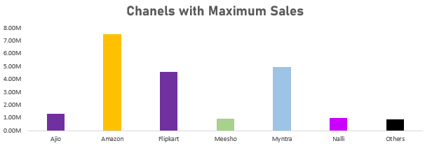
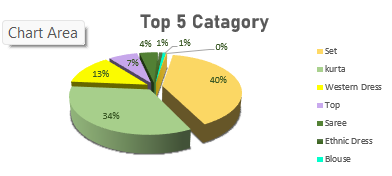

# Super Market Data Analysis 

Description :
-

Super Market Salse Analysis’ It’s aimed to help the store create an annual sales report , analyze customer behavior and boost customer sales . I performed various tasks such as data understanding, data cleaning ,processing ,analysis ,visualization and report creation. 

  

This project includes steps as follows :
-
- Understanding the Problem statement
- Data Cleaning and Preprocessing
- Explotory data analysis (EDA)
- Data visualization 

The project also answered important questions such as :-
 -
1. Compare the Sales and orders using chart?
2. Who purchased more , men or women in 2022 ?
3. What are different order statuses ?
4. Which are the top 10 states contributing to sales?
5.  What is the relation between age and gender based on the number of orders?
6. Which channel is contributing maximum sales ? 
7. Top clothings category got the highest number of order ?

📈 Based on the report insights ,here are the outcomes of the sales :- 
 -
1. In my report, I found that March has the highest sales and order numbers, while November has the lowest. Additionally, there is a noticeable decline in sales and order quantities after March.

  

2. Women are more likely to purchase (69%) than men.

  

3. In my dataset, the different order statuses are primarily categorized as:
- 92.25% of orders are marked as "Delivered".
- The remaining percentage consists of orders that are "Cancelled", "Refunded," or "Returned".

4. Top 10 states :
 

  

5.  The adult age group (30-49 yrs) made the most contributions.
 

  

6. Amazon, Flipkart and Myntra channels were the top contributors.
 

  

7. The 'Set' clothing category received the highest number of orders, comprising 40% of the total.

  

Conclusion
-
 The final conclusion to improve store sales is to target women customers of age group (30-49 yrs) living in Maharashtra , Karnataka and Uttar Pradesh by showing ads/offers/coupons available on Amazon ,Flipkart and Myntra.

## Authors

- [@Santanudutta1](https://github.com/SantanuDutta1)

Santanu Dutta - Data Analyst - Santanu Data - All work
